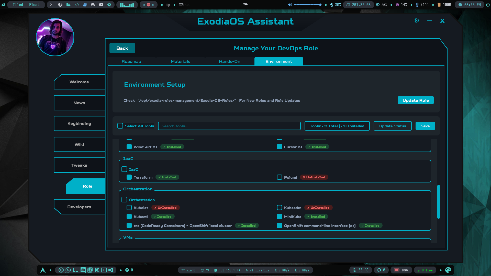

# ExodiaOS Roles

This repository contains a collection of roles for the Exodia OS Assistant, organized into two main categories:

- **official/**: Officially maintained roles by the Exodia OS team.
- **community/**: Community-contributed roles for extending and customizing the Exodia OS Assistant.

## Structure

- `official/` - Official roles, curated and supported by the Exodia OS maintainers.
- `community/` - Roles contributed by the community. These may vary in quality and support.

## Contributing

Contributions are welcome! Please see the README files in each directory for more details on contributing to official or community roles.

## Showcase

Below are some screenshots showcasing the Exodia OS Roles in action:

| Role Overview | Role Selection | Role Creation |
|:-------------:|:--------------:|:-------------:|
|  |  |  |

| Role Exploration | Role Materials | Role Roadmap | Role Environment Setup |
|:----------------:|:--------------:|:-------------:|:---------------------:|
|  |  |  |  |
 